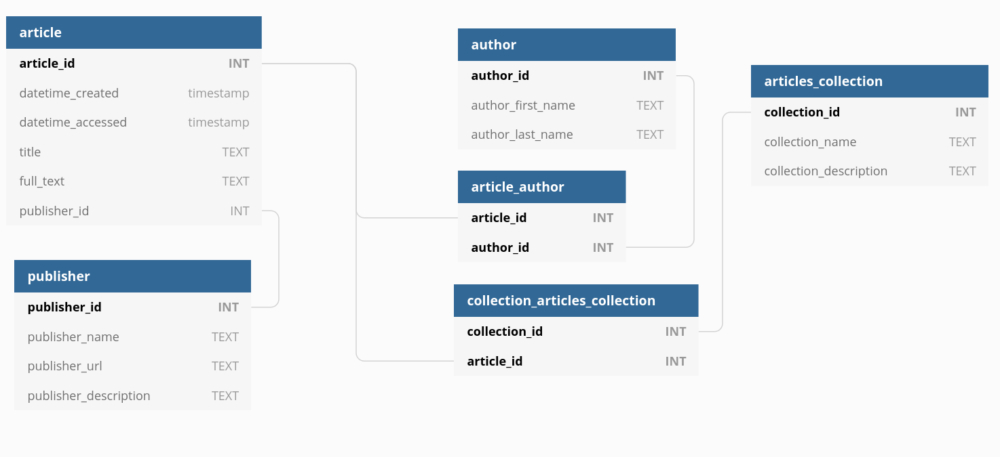

# Pipeline for articles scraping with scrapy, postgres and sqlalchemy
A simple customizable pipeline to capture articles in a specific format for text analysis. 

## Features
- Setup database easily with `docker-compose` 
- Define your own crawlers and pipelines
- Predefined database model to start collecting data

## Entity relationship diagram

## Usage
- We recommend to create a specific virtual environment for the project
- Run `pip install -e .` to develop and modify modules.
- Run `scrapy crawl example`
- Run the `example.ipynb` notebook to explore the database.
- Enjoy :)

